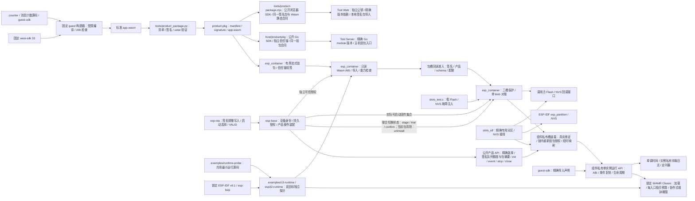

# ESP Container

新增[消息计数产品样例](examples/message-counter/README.md)：counter v0-2-0 在原 ABI／包格式下提供二进制消息计数、三态与单个 100 ms 定时窗口，声明 timer 能力和零持久数据。公开固定构建器与签名包槽宿主回归可独立执行；保持 Base 现有精确依赖，双板正式安装仍待验收，不扩大平台授权。

`esp-container` 是面向 ESP-IDF 的业务包运行组件。当前提供独立 `esp_container` IDF 组件、受限 Wasm 扫描器、counter guest 的固定 freestanding 构建与静态检查、公开 guest SDK 草案、确定性 ustar 打包与 RSA-3072/PSS 验包工具、浏览器／Node Web Crypto 验包 SDK、只读回调式设备验包及 Wasm ABI/能力检查切片、三槽原始 Flash 存储软件切片、双固件集合对账与联合固件/包切换的单 blob 状态合同、精确分区前置的 ESP-IDF Flash/NVS provider，以及 WAMR Classic 单实例运行切片。三槽候选回读组合签名包、Wasm 与独立产品/配额授权；公开产品生命周期入口仅从实际确认绑定或本 boot 的精确试运行记录装载，组件内部在同一槽锁下重新验包授权、短时映射并完成 WAMR 装载，裸 Wasm 装载仍是私有接口。运行期使用 ABI 2 的页内事件区，保持完整 64 KiB 标准内存边界，并提供逐项授权的单调时间、有界日志和受配额定时器导入。实际专用包分区、完整签名包安装、Base 联合升级与实板容量尚未完成，当前代码只可作为研发检查点。

`econtainer_slots_uninstall` 可在 Base 停止并回收当前确认实例后，以精确包摘要和固件集合清除当前固件的包绑定。它持久读回 `NO_PACKAGE` 终态，保留回退固件绑定和包 Flash 字节；Base 的公开卸载命令已接入持久账本、同 boot 空绑定读回与运行重启；实板验证仍待完成。详见[三包槽存储检查点](docs/operations/three-slot-storage-checkpoint.md)。

`econtainer_product_open` 只有在实际选中包从 Flash 重新验签、授权并成功创建 runtime 后，才向 Base 返回签名清单中的事件队列额度及包 SHA-256；拒绝和运行时创建失败时这两项均为零。Base 据此限制外部业务事件入队，并将事件绑定到当前包身份。

装载成功现同时返回本次验签清单的产品 ID／完整版本切片和 ABI／data schema。切片位于调用方的 `validation.package_workspace->manifest`，解除 Flash 映射后仍可读取，工作区被修改前必须完成复制；组件不返回映射地址，也不另建版本缓存。仅 slots／runtime 均为 OK 且实例非空时填充，失败时六项元数据均为零。版本仍受既有整份 4096 字节清单上限约束，没有新增 64 字节限制。确认绑定与 trial 的精确选择合同保持；这些元数据不代替 init、健康或持久确认。Base／Tool 的独立候选已消费对应 C 接口，接通实际版本与 trial 回读；双板实物与正式发布仍待验收。

[Go 主机 SDK](host/README.md)现提供同一 `product.pkg` v1 的标准库验包入口，供 Go Server 在制品登记前独立核对可信公钥、完整包字节、签名清单与 Wasm 静态合同。源码由本仓拥有，消费者通过精确 Go module 版本消费；不增加 Node／Python 服务运行依赖。规范清单编解码供验签后元数据持久化使用，单独编解码不证明签名有效。

ESP-IDF provider 要求调用方分别提供槽操作锁与物理 I/O 租约回调。包分区读、擦、写及专用 NVS blob 的一次访问各自获取和释放租约；释放失败使该次操作返回 I/O 失败。映射在 map 至 unmap 期间持有租约；解除映射时释放失败会关闭刚装载的 runtime，阻止 guest 入口。映射窗口还包含验包与解释器装载，其时长上界仍须测量。Base 的装配把租约接到 FRP scratch 使用的 owner；完整 app/其他 NVS 仲裁及实板并发仍待验证。

## 架构拓扑



IDF 组件物理路径为 `components/esp_container`，其名称与仓库 `esp-container` 属不同命名空间。公开 Git 消费方须把完整提交 SHA 和 `path: components/esp_container` 写入 `idf_component.yml`。WAMR 由该组件的 manifest 固定到[公开维护 fork](docs/design/source-provenance.md) 的完整修复提交；[SDK 锁](components/esp_container/sdk-lock.json)固定公开 ESP-IDF fork `578cf89c343e388db43ba1f4ddcd602fedcb763c` 与 lwIP 源码，组件构建核对锁定组合。组件配置还要求 Classic/Normal loader、指令计量及 Classic 协作式墙钟期限，并拒绝 WAMR 默认开启的 AOT/Fast/WASI/guest pthread/shrunk memory 等特性；消费者按 [C3 样例](examples/c3-runtime/README.md)或 [ESP32 样例](examples/esp32-runtime/README.md)在 `project()` 前设置计量、期限及 bulk/shared/shrunk memory，且在各自 `sdkconfig.defaults` 设置 WAMR Kconfig。两个样例共享同一探针源码，不读取相邻工作区、私有 Tool 或生产凭据。

## 本机验证

```bash
python3 -m venv .venv
.venv/bin/pip install -r requirements.txt
.venv/bin/python -m unittest discover -s tests -p '*test*.py' -v
cmake -S . -B build -DBUILD_TESTING=ON
cmake --build build
ctest --test-dir build --output-on-failure
```

浏览器／Node 的公开 host SDK 使用 `npm test`；不依赖 IDF 或第三方 Node 包。Python 全量测试在 Node 22+ 可用时，另对独立生成的正确签名、错误清单／归档／Wasm 字节与该 SDK 做接受结果及元数据交叉比对。浏览器需要安全上下文的 Web Crypto；这里只验包，不实例化或执行 guest，也不发设备命令。

Go SDK 在 `host/` 执行 `go test ./...`、`go test -race ./...` 和 `go vet ./...`；Python 全量测试在 Go 可用时另核对 37 份独立签名输入与返回元数据。无 Go 时该项明确跳过；Go module 归档可独立执行固定向量与负例测试。

完成 C3 样例构建并核对 `dependencies.lock` 后，可用其锁定的 WAMR 源码运行真实 Classic 解释器主机测试：

```bash
cmake -S . -B build-wamr -DBUILD_TESTING=ON \
  -DESP_CONTAINER_WAMR_SOURCE="$PWD/examples/c3-runtime/managed_components/wasm-micro-runtime" \
  -DESP_CONTAINER_WASI_SDK_ROOT="$WASI_SDK_ROOT"
cmake --build build-wamr
ctest --test-dir build-wamr --output-on-failure
```

设置官方 wasi-sdk 33 的 `WASI_SDK_ROOT` 时，`runtime_instance` 会编译真正的 counter、定时器、期限和故障 guest，在锁定 WAMR 上检查单实例、事件复制、ABI、三个入口的指令额度与纯 Wasm 循环期限、逐项导入授权、日志边界、定时器取消与代次隔离、超期成功结果拒绝，以及各 100 次普通、原生导入与失败后重开生命周期。macOS 普通构建还核对第 10/50/100 次关闭后的堆和虚拟地址用量；没有该工具链时仍可运行其余 CTest。详见[运行切片检查点](docs/operations/single-instance-runtime-checkpoint.md)、[宿主导入检查点](docs/operations/host-api-checkpoint.md)和[双目标 Classic 期限独立探针](docs/operations/classic-deadline-probe-checkpoint.md)。解释器在安全分派点检查期限，调度延迟仍会影响返回耗时；同步原生导入无法在阻塞中被中断。双板已验证最小样例，完整产品运行仍待验。[counter guest 样例](examples/counter/README.md)记录固定编译与静态 ABI/profile 检查入口；[counter v2](examples/counter-v2/README.md)和[同固件源码更新检查点](docs/operations/product-source-update-host-checkpoint.md)记录主机签名换包行为。

host 工具的包格式和使用步骤见 [包工具](tools/README.md)。[只读流式验包与 Wasm 静态检查切片](docs/operations/package-stream-checkpoint.md)记录设备代码与 host 互验边界；静态检查必须接收验包结果及独立可信授权，签名清单只表达需求，不能自行授予设备能力。[三包槽存储检查点](docs/operations/three-slot-storage-checkpoint.md)记录保护集、commit/读回、IDF provider 与恢复软件边界。[C3 单页切片](docs/operations/c3-low-memory-profile.md)记录本分支对 guest、清单、设备扫描与运行期的一页限制。[C3 原型](examples/c3-runtime/README.md)需要固定 SDK；原样 WAMR 2.4.4 与固定 IDF 6.1 的编译问题已在公开 fork 的源码中直接修复，具体构建结果见[开发检查点](docs/operations/development-checkpoint.md)。[五组件仓外容量原型](docs/operations/five-component-capacity-probe.md)记录签名镜像与分区几何，[QEMU counter 容量切片](docs/operations/qemu-counter-capacity-probe.md)记录独立 C3 样例的动态堆采样，[五组件链接 QEMU 容量切片](docs/operations/five-component-qemu-capacity-probe.md)记录 C3 组合读数，[ESP32 五组件签名容量探针](docs/operations/esp32-five-component-capacity-probe.md)记录旧锁的 ECDSA v1 静态镜像与候选几何，[ESP32 认证记录 QEMU 容量探针](docs/operations/esp32-authenticated-qemu-capacity-probe.md)记录新锁的单页 guest 与完整密文动态读数；这些证据均未闭合产品容量验收。本地构建不会写板。Base 已接公开安装／升级、签名包装载与同 boot 候选试运行的软件路径；业务健康成功终态、正式分区迁移和实板验收仍未闭合，不能把验包成功当作可发布的设备安全启动。

[C3 Wi-Fi IRAM 两项开关的 QEMU 容量对照](docs/operations/c3-wifi-iram-qemu-ab.md)记录同输入实验中完整 AEAD reader 与一页 guest 的结果及实际 FRP 会话仍未闭合的内存缺口。

[C3 空闲 FRP client QEMU 容量探针](docs/operations/c3-frp-client-qemu-capacity-probe.md)记录真实创建／销毁 API 在一页 guest 存活时的堆占用，以及无会话手工满长认证记录的同存边界。

[C3 OpenETH 与官方 FRPS 会话容量探针](docs/operations/c3-frps-qemu-session-capacity-probe.md)记录 guest 存活时真实 `efrp_start` 在 TLS OPEN 后因 Yamux 对象分配失败而停止的阶段读数；登录、注册、Pong 与会话内满长记录尚未执行。

[C3 注册会话中的 32BIT 堆能力实验](docs/operations/c3-registered-32bit-qemu-capacity.md)在 Yamux 与工作流缓冲按需分配后的独立 QEMU 输入中到达注册和首个 Pong，逐笔观测 `MALLOC_CAP_32BIT` 与 8BIT 的共享容量；第 4 笔 4 KiB 申请失败，没有独立 64 KiB 池。该报告保留上述旧 FRP 阶段事实，不把新实验扩展为会话内满长记录或实体板验收。

[ESP32 OpenETH 与官方 FRPS 会话容量探针](docs/operations/esp32-frps-session-qemu-capacity-probe.md)记录相同类型的五仓仿真在严格 TLS 完成后，创建 18,872 字节 FRP session 时连续内存不足；两次同签名镜像重跑均未到达登录、注册或 Pong。直接 AEAD reader 的成功不代表会话内记录已通过。

[ESP32 Wi-Fi IRAM 两项开关对照](docs/operations/esp32-wifi-iram-qemu-ab.md)记录相同输入下 IRAM 减少、动态堆却不变的结果；两板不能共用这两项开关的容量结论。

[双目标 FRP 同存内存下界](docs/operations/dual-target-frp-guest-memory-bound.md)按当前源码逐项计算满长记录与单页 guest 同存时的必要空间；它不替代实际会话和实板验收。

[双目标 4 MiB Flash 容量边界](docs/operations/dual-target-flash-layout-boundary.md)核对当前包格式上界、两块实板各自的旧区保存与双 app 几何，以及首次分区切换必须具备的外部恢复条件；这是离线设计检查点。

[双目标无探针签名 Base 链接下界](docs/operations/dual-target-signed-product-link-bound.md)核对现行主应用签名镜像的 ELF/map，区分真正保留的 FRP/MQTT/OTA 与仅编译的 Container/WAMR。

[ESP32 EXEC／32BIT 能力池探针](docs/operations/esp32-exec-pool-qemu-probe.md)记录同阶段纯 IRAM、共享 D/IRAM 与不同对齐请求的真实申请；它没有把仅支持 32BIT 的内存交给 AEAD 或 WAMR。

## 项目边界

- 本仓拥有 WAMR 集成、guest ABI、包验证、实例生命周期、资源配额和三包槽机制；主机包工具现与设备流式扫描器对齐签名清单和 Wasm 字节可确定的 Classic/ABI 静态准入，另有 counter 样例编译检查。
- `esp-base` 拥有设备身份、配置、授权与平台装配；`esp-ota` 拥有固件 A/B 升级。业务包不会写入 app OTA 槽。
- C3 4 MiB 双固件与三包槽的真实容量、RAM 峰值和分区迁移必须先按[跨仓开发计划](https://github.com/darren-you/darren-space/blob/master/harness/docs/design/darren-space/global/esp-base-frp-mqtt-ota-container-development-plan.md)第 9、12、13 节验证。未获得明确设备授权时不刷板、不改分区。
- 新代码 Apache-2.0；上游依赖保持[精确来源与许可](docs/design/source-provenance.md)。

## 入口

- [IDF 组件与公开头](components/esp_container/include/esp_container.h)
- [只读流式验包 API](components/esp_container/include/esp_container_package.h)
- [候选包槽回读准入 API](components/esp_container/include/esp_container_package_slot.h)
- [三槽存储 API](components/esp_container/include/esp_container_slots.h)与 [ESP-IDF provider](components/esp_container/include/esp_container_slots_idf.h)
- [公开产品生命周期 API](components/esp_container/include/esp_container_product.h)与[软件验证边界](docs/operations/public-product-lifecycle-checkpoint.md)
- [组件私有槽装载合同](components/esp_container/src/slot_runtime_internal.h)与[软件验证边界](docs/operations/three-slot-storage-checkpoint.md)
- [guest SDK 与 counter 编译样例](examples/counter/README.md)、[counter v2 源码更新样例](examples/counter-v2/README.md)
- [主机包工具](tools/README.md)
- [C3 原型](examples/c3-runtime/README.md)
- [ESP32-D0WD-V3 原型](examples/esp32-runtime/README.md)
- [双目标共用运行探针](examples/runtime-probe/README.md)
- [测试](tests/README.md)
- [嵌入式工程标准](https://github.com/darren-you/darren-space/blob/master/harness/docs/workspace/standards/embedded_firmware/embedded_firmware_golden_path.md)
