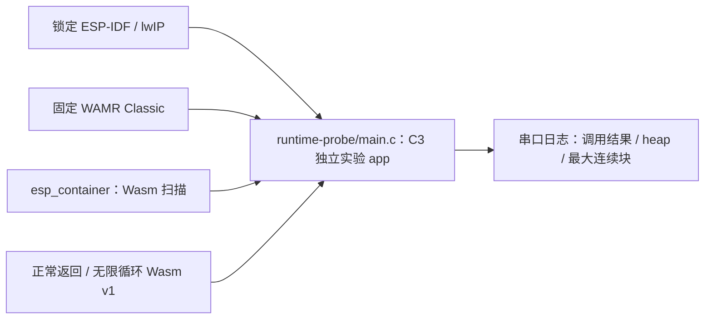

# ESP32-C3 WAMR Classic 容量与指令预算原型

这个独立 IDF 工程使用两段无 imports、无 start 的标准 Wasm v1 字节：正常函数返回 0；死循环函数分别验证 1000 条指令额度和 20 ms 单调墙钟期限，只有对应的精确异常才算通过。期限一轮把指令额度设为 `INT32_MAX`，调用后清除期限并记录历时；它是协作式检查，历时不是硬实时承诺。构建时显式开启 WAMR 指令计量与 Classic 墙钟期限，选择 Classic/Normal loader，并关闭 Fast/AOT/WASI/guest pthread/共享内存与 bulk memory；`esp_container` 组件在 CMake 配置期拒绝错误组合。实例化前调用 `econtainer_wasm_check`，防止 WAMR 自动运行 start 或构造导出。运行时打印前后 8-bit heap 和最大连续块。C3 实板只有原生 USB Serial/JTAG 端点，控制台固定使用它；构建后须回读最终 `sdkconfig` 的 `CONFIG_ESP_CONSOLE_USB_SERIAL_JTAG=y`，不能把 UART0 默认值当作实板可观测入口。

SDK 必须使用跨仓计划锁定的公开 ESP-IDF fork `578cf89c343e388db43ba1f4ddcd602fedcb763c`（直接父提交 `855937cf9dcee13ee9c423fb0319238cdc8d53fd`，官方祖先提交 `fff9895c82d744c7237be8847347bdd1b07c6643`）与 esp-lwip `2758df4cd3666b3b2a5b53830148379326425c0d`。WAMR 由组件清单固定到公开维护 fork 的 `c10736fffdf26d7c2ae234e05aa712df112eb6bf`；构建后核对 `dependencies.lock` 和 WAMR 源编译 flags，再记录镜像摘要。此工程无 Wi-Fi、MQTT、FRP、OTA、签名包和产品驱动，不能当作完整 Base 容量验收。

```bash
source "$IDF_PATH/export.sh"
python3 components/esp_container/tools/check_sdk.py --path "$IDF_PATH"
idf.py -C examples/c3-runtime build
```

编译不写板。真实设备实验按工作区五仓开发计划第 1.5、12、13 节执行：每次写入前重新确认精确设备、串口独占、当前固件/配置与两份一致的完整恢复基线，实验后恢复并读回。[2026-09-26 C3 最小探针实板记录](../../docs/operations/development-checkpoint.md#c3-原生-usb-实板最小探针)已完成正常调用、指令额度异常和完整 Flash 恢复。这个独立例子的运行不能替代双固件、三包槽及五组件组合验收。

## QEMU 仿真验证

固定 SDK 的官方可选 `qemu-riscv32` 支持 ESP32-C3。安装后重新导出 SDK 环境，再运行样例：

```bash
python3 "$IDF_PATH/tools/idf_tools.py" install qemu-riscv32
source "$IDF_PATH/export.sh"
idf.py -C examples/c3-runtime qemu
```

探针使用 IDF pthread 入口运行 WAMR；其 ESP-IDF 移植层会调用 `pthread_self()`，普通 `xTaskCreate()` 任务不具备该线程身份。当前实板配置的主控制台为 USB Serial/JTAG；官方 C3 QEMU 的 `-serial mon:stdio` 只回传 ROM/UART 日志，运行上述命令不能从终端判定探针结果。需要核对 QEMU 中的 WAMR 调用时，应在仓外独立工程以同一源码、SDK 和 WAMR 锁构建 UART0 控制台变体，且不得把该变体交给只有原生 USB 端点的实板。UART0 变体应打印 `before` 的空闲堆与最大连续块、三次调用的精确异常、`after` 资源值，以及 `normal=1 instruction_limit=1 wall_clock_deadline=1`。[128 KiB counter guest 仿真记录](../../docs/operations/qemu-counter-capacity-probe.md)另列加载、实例化、调用与卸载的堆采样；该实验的 C 代码仅在仓外临时副本，不属于本样例正式入口。仿真只验证最小代码路径，不代表实板资源峰值、完整产品装配或 Flash 包槽验收。

## 架构拓扑


