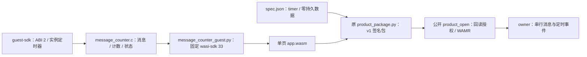

# 消息计数产品样例

这是 `counter` 产品的 `v0-2-0` 业务源码，保持 guest ABI 2、`wamr-classic-v1` 和 data schema 1。它提供二进制消息体字节计数、idle／active／paused 状态与一个 100 ms 单次窗口。没有 GPIO、WASI、线程、网络或持久数据；`storage_limit_bytes` 为 0，停止／重新装载后 RAM 计数归零。平台须独立授予 timer 能力和至少一个定时器，清单不能自行授权。

## 架构拓扑



## 事件字节

首字节是命令，非负返回值为业务结果，负值为业务拒绝。

| 首字节 | 精确长度 | 行为与结果 |
| --- | --- | --- |
| `01` | 至少 2 字节 | 累计其余消息体字节，返回总数；暂停时返回 -2 |
| `02` | 1 字节 | 取消窗口并暂停，保留计数，返回总数；重复暂停可接受 |
| `03` | 1 字节 | 仅从暂停恢复至 idle，返回总数；不启动定时器 |
| `04` | 1 字节 | 状态：idle=0、active=1、paused=2 |
| `05` | 1 字节 | 返回累计消息体字节数 |

idle 的首条计数消息开启一个 100 ms 单次窗口并进入 active，窗口内后续消息共用定时器，不延期。owner 在 guest 入口之外串行投递到期事件，使 active 变回 idle，累计计数保持。暂停取消窗口，恢复后下一条消息才重新开启。宿主在调用 guest stop 前已撤销全部定时器，stop 只清理 guest 状态，不再次取消已撤销句柄。保留的 ECT 定时器前缀只供宿主，业务发布方不得构造 timer 事件；旧句柄不影响当前窗口。

-1 表示空事件、未知命令、长度错误或错误状态；-3 表示计数将超过 INT32_MAX；-4 表示定时器创建／取消失败。计数消息在成功建立窗口前不增加计数，无效命令不改变状态或计数。零字节也计数，不将消息当作 C 字符串；各入口有界，不阻塞或保留外部事件指针。

## 构建与签名

工具链沿用 [counter 说明](../counter/README.md)的官方 wasi-sdk 33 资产、校验和与 WASI_SDK_ROOT。在仓根安装现有 Python 依赖后执行：

```bash
.venv/bin/python tools/message_counter_guest.py --wasi-sdk "$WASI_SDK_ROOT" --output dist/message-counter/app.wasm
.venv/bin/python tools/product_package.py manifest --spec examples/message-counter/spec.json --wasm dist/message-counter/app.wasm --output dist/message-counter/manifest.json
.venv/bin/python tools/product_package.py sign --manifest dist/message-counter/manifest.json --private-key test-private.pem --key-id test-key --output dist/message-counter/signature.bin
.venv/bin/python tools/product_package.py pack --manifest dist/message-counter/manifest.json --signature dist/message-counter/signature.bin --wasm dist/message-counter/app.wasm --output dist/message-counter/product.pkg
.venv/bin/python tools/product_package.py verify --package dist/message-counter/product.pkg --public-key test-public.pem --key-id test-key
```

签名路径和 test-key 仅装配已有测试材料，不创建生产信任锚。构建器沿用既有固定单页、4 KiB 栈与显式 ABI 导出，编译后调用原公开包扫描器验证精确导入与 capability 清单。无导入 counter 的更窄静态检查保持原合同。代表事件 `01 02 03` 的消息体为两个字节，结果为 2；原字节摘要须由 Base 产品请求和随后授权事件绑定。

## 验证边界

`slot_runtime` CTest 从真实源码生成临时 RSA-3072/PSS 签名包，经公开 product API 回读授权，在锁定 WAMR 上验证消息计数、暂停／恢复、无效消息不变、单 timer 配额、真实到期、停止取消和同 boot 重开归零，再放弃候选、恢复旧 counter。Flash/NVS、固件集合和健康依据仍为宿主夹具；直接 mark_healthy 不证明 Base 的代表事件与连续 30 秒联网健康。

业务包保持原 ABI 与宿主导入合同；不以新增示例为由升级 Base 固件或精确 Container pin，平台仍须独立核对授权。未改变现有授权或实体设备绑定。实体 C3／ESP32 的公开安装与 MQTT 路径、峰值及恢复尚未验收，P6-11 不因示例生成而完成。
