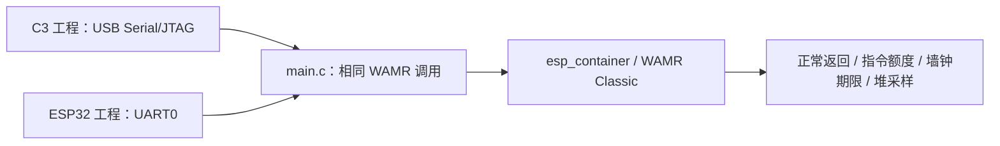

# 双目标共用运行探针

`main.c` 由 [C3 工程](../c3-runtime/README.md)和 [ESP32 工程](../esp32-runtime/README.md)分别编译。它在 WAMR Classic 中执行一个正常返回模块，并用同一个无限循环模块分别检查 1000 条指令额度和 20 ms 单调期限异常；期限调用另给 `INT32_MAX` 指令额度，避免先触发指令门。每次调用使用独立的可写 Wasm 字节副本、新实例和执行环境；WAMR loader 对第一份字节的改写不会污染下一次扫描。结束后清除期限，记录异常、历时及前后堆状态。历时只供观察，不能作为硬实时上界。target、控制台、分区和依赖锁均由各自工程确定；此目录不单独构建，也不写设备 Flash。

## 架构拓扑

