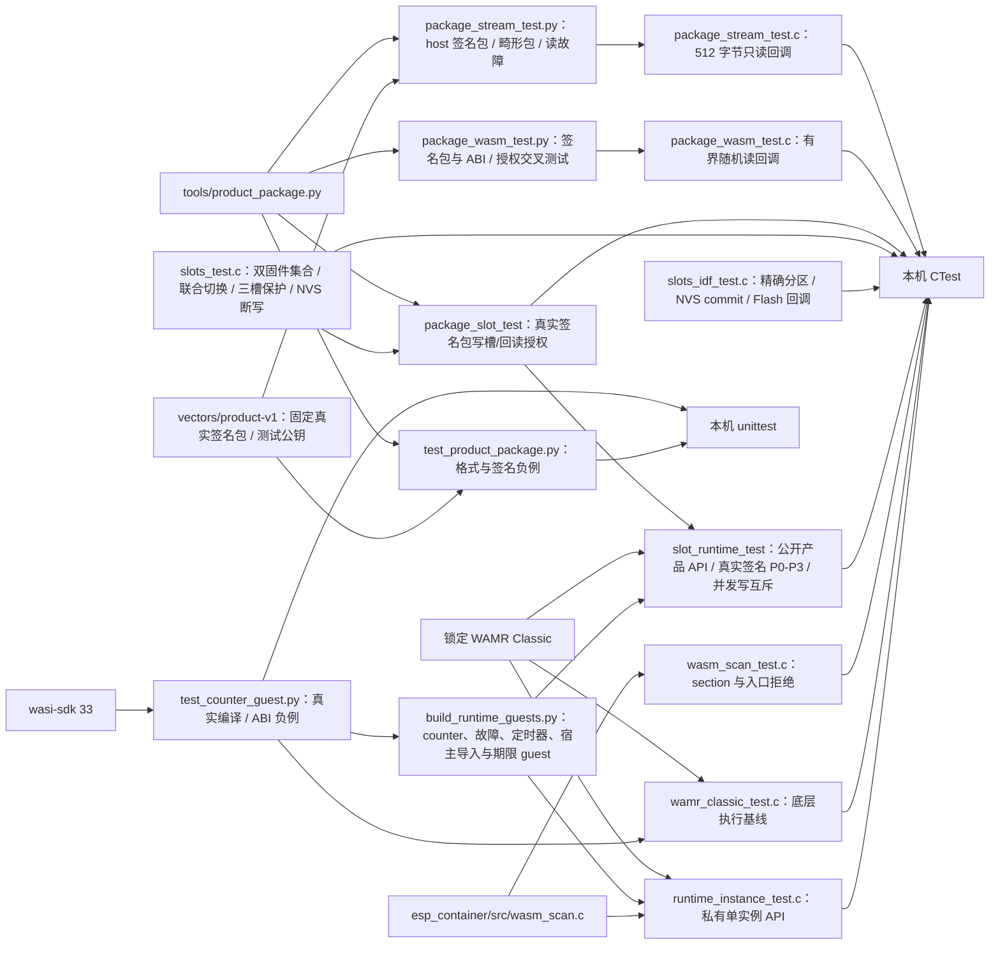

# 测试入口

`package_slot` 使用真实 RSA-PSS 包验证同产品同版本异整包 SHA 拒绝，包括同清单随机重签、当前及回退引用、损坏引用／读取失败、同 SHA 持久元数据不符；合法不同版本、另一产品和旧回退 ABI 保持原合同。2049 字节版本覆盖完整相同、共同前缀尾部不同与长短不同，读块不超过 512 字节。同 SHA 引用不再额外整包验签。`slot_runtime` 与 `host_call_timeout` 还从公开产品 API 拒绝仍保留的冲突／损坏回退包，检查失败元数据清零、映射收敛；固件 REUSE 退役该回退绑定后，同一当前包可实际初始化、停止并关闭。不同代码的旧配额夹具现在声明各自版本，避免与本轮身份合同冲突；旧 Timeout 不是配额通过证据。

`host_call_timeout` 复用 `slot_runtime` 的真实签名包、公开产品 API、假 Flash/NVS 与锁定 WAMR。仅独立测试库把实际 `runtime.c` 的 POSIX 时钟符号接到确定性夹具；WAMR 平台时钟和生产运行配置不变。它验证签名 100 ms 与平台 500 ms/20 ms 的双向交集，四种导入的成功、非法参数、日志 busy 和 timer 满槽返回，四个各自合法短调用的总耗时超过 100 ms 仍成功，以及 init/stop、既有引擎异常、入口超期、取消优先级和时钟失败/回退/加法溢出。超期不交付 guest 结果；旧日志保留、新日志丢弃，失败实例拒绝 timer 投递，关闭重开无旧资源。加法溢出夹具只证明软件边界，准备阶段使用未来时钟偏移避免真实解释器期限抢先，不是宿主或实板墙钟测量。

`runtime_instance` 使用真正的宿主请求线程和 owner 原子谓词，验证 init／事件长循环取消、保留既有日志并丢弃取消入口新日志、定时器取消、实际 guest stop 和停止失败阻断；另有 100 次取消／关闭／重开及 10/50/100 次原生资源采样。goto／switch 分派和 ASan/UBSan 结果见[异步取消检查点](../docs/operations/async-cancel-checkpoint.md)。

`slot_runtime` 新增真实签名[消息计数产品](../examples/message-counter/README.md)，使用原公开 product API 与一个 timer 配额验证消息／三态／真实到期／停止取消、同 boot 重开归零和旧确认包恢复。清单声明零持久数据；Flash/NVS、固件集合与健康仍为宿主夹具，未走 Base 公开网络安装或设备健康确认。

`slots` CTest 的 product-only 卸载用精确包摘要和停止证明清除当前绑定，覆盖共享包槽、回退固件引用保留、后续预留避开回退槽、损坏回退包拒绝、NVS 写前失败与写后读回不确定。`slots_idf` CTest 在真实 `slots_idf.c` 回调下重建 provider，读回无包当前绑定和有包回退绑定，并覆盖 commit 失败和 commit 已生效但返回失败；另核对包 Flash／专用 NVS 操作持有短时 I/O 租约、获取失败不触碰存储、映射至解映射期间保留租约且释放失败返回 I/O 失败。`slot_runtime` CTest 还在解除映射失败时检查新 runtime 已关闭且 guest 未进入。该测试使用合成 SDK，不代表物理掉电或 Base 命令接线。

## 架构拓扑



```bash
python3 -m unittest discover -s tests -v
cmake -S . -B build -DBUILD_TESTING=ON
cmake --build build
ctest --test-dir build --output-on-failure
```

`wamr_classic` 是底层真实引擎基线：先构建 C3 样例并核对锁文件中 WAMR 的 Git SHA 与 `.component_hash`，再按仓根 README 的 `ESP_CONTAINER_WAMR_SOURCE` 命令重新配置主机 CMake。该测试把正常执行与精确的 `Exception: instruction limit exceeded` 分开判定；其他 trap、加载失败和初始化失败都不能冒充额度命中。

同时设置 `ESP_CONTAINER_WASI_SDK_ROOT="$WASI_SDK_ROOT"` 会增加 `runtime_instance`：构建时临时编译真实 counter、事件读取、三个死循环、stop 返回失败、错误函数签名、时钟/日志、定时器和期限 guest；测试单实例占用、原始输入释放后继续调用、guest 内存中的事件复制、分离 guest 返回值与宿主状态、内存页上限、页内事件 buffer ABI 错误拒绝、每入口正数指令预算、三个纯 Wasm 死循环的入口期限与失败后重开、失败后释放、重复 stop/close、一次及周期定时事件、配额/取消/代次、停止后拒绝迟到投递，以及各 100 次 counter、时钟/日志、定时器和失败后重开生命周期。期限 guest 分别检查运行中导入拒绝与返回后结果拒绝，并核对本次日志丢弃、失败态和关闭。macOS 非 sanitizer 构建在每组第 10/50/100 次关闭后检查 `malloc_zone_statistics` 堆用量与 `TASK_VM_INFO` 虚拟地址用量持平，并记录 VM 区域数。生成的 Wasm 留在构建目录，不提交。此私有 API 在 ESP-IDF 上必须由同一个 `pthread_create` 宿主线程串行调用；普通 `xTaskCreate` 任务调用 WAMR 会在 `pthread_self` 断言。完整合同见[运行切片检查点](../docs/operations/single-instance-runtime-checkpoint.md)和[宿主导入检查点](../docs/operations/host-api-checkpoint.md)。

设置 `WASI_SDK_ROOT` 为官方 wasi-sdk 33 的解压目录后，Python 测试还会真实编译 counter 两次并比较不同输出路径的字节，验证包扫描接受产物，同时用改坏的函数签名、共享/无界内存、目标特性节和自动 start 作负例。先运行 `python3 tools/counter_guest.py build --wasi-sdk "$WASI_SDK_ROOT" --output dist/app.wasm`，再运行 `build-wamr/wamr_classic_test dist/app.wasm`，可让固定 WAMR Classic loader 实际执行三个 guest 入口；未提供该工具链时，counter 编译测试会明确跳过。

Python 测试使用每次生成的 RSA-3072 临时测试密钥，覆盖确定性归档、签名/错误公钥与错误 PSS 参数、清单顶层及嵌套重复键、未知字段和数值边界、Wasm start/导入白名单/构造入口、导入能力与 manifest 的对应、成员路径/顺序/类型/长度白名单、校验和、成员填充、额外成员、尾随非零或全零块及容量拒绝。固定占位签名的 host 编码回归向量改用最小有效 Classic ABI 模块，摘要见[包工具](../tools/README.md)；占位签名不能用于验签或发布。[公开真实签名向量](vectors/product-v1/README.md)让主机与 C 流式验包器复核同一份既定包字节。流式验包 CTest 还以动态真实签名包、独立错误公钥、错误 PSS salt、畸形清单/ustar、断读与 64 KiB 载荷验证 512 字节读取上界。Wasm 静态检查 CTest 使用相同 Wasm 字节对照主机初筛与设备只读检查；旧主机曾接受的 `target_features`、缺失 ABI section、table、element、空导入节、入口签名、代码数量和签名清单内存上限八类负例现均由双方拒绝，并继续覆盖独立授权、坏 LEB/section/重复导入和读故障。设置固定 `WASI_SDK_ROOT` 后还检查真实编译的 counter、时钟/日志与定时器 guest。三槽 CTest 用假 Flash/NVS 注入 commit、读回及部分写入故障，验证 P0→P3 引用保护、两份固件各自重启对账、错误固件集合与超槽容量的擦除前拒绝、候选损坏下的旧包恢复及同 boot 停止证明；联合切换另覆盖签名新固件替换后旧备用包不再受保护、新固件 PREPARED 才允许启动 trial、旧 trial 跨 boot 阻断、无包确认与回退删除绑定。IDF provider CTest 以合成分区表检查缺失/错类型/只读/越界拒绝、绝对 Flash 地址转换、NVS 单 key commit/新 handle 读回，以及单固件集合下的三槽初始化和对账；它没有运行当前 Base 分区布局。C 测试还覆盖组件扫描的正常、截断、start、导入与隐式构造入口。动态测试私钥只存在系统临时目录，固定向量只提交公钥与签名包。

`package_slot` CTest 将真实临时签名包写入假 Flash 三槽，由槽引擎从实际候选槽回读，再执行签名、Wasm、产品身份、schema 和资源限额检查；错误产品、key ID、schema、内存、队列、指令预算、宿主期限均返回 `UNTRUSTED`，验签和 Wasm 静态扫描的二次读故障分别返回 `IO_FAILED`，均不得进入 PREPARED。联合切换的 REUSE 模式还用同一真实签名包证明新固件独立产品授权失败时不可持久化、通过时不复制 Flash 且只能在确认后共享包槽。`slots` CTest 另覆盖旧备用固件已由 Base 证明不可启动时的 A/B→A 绑定退役、当前序号的 A-only 无写入重入、随后 A/C 准备，以及未决相位、错固件、坏包、commit/读回故障的拒绝。该测试不证明设备真实分区、Base 的 OTA 收据或物理固件集合。

同时提供锁定 WAMR 与 wasi-sdk 33 后的 `slot_runtime` CTest。Python 在临时目录生成 RSA-3072 密钥，把真实编译 counter v1 签成 P0/P1、[counter v2](../examples/counter-v2/README.md) 签成 P2/P3；C 测试只包含公开 `esp_container_product.h`，通过正常 `reserve → write_and_prepare → begin_trial → product_open/init/event/stop/close → mark_healthy → confirm` 更新两个固件的真实持久绑定，并保持旧固件 P0 可恢复。P1→P2 在同一固件 B、同一 boot 中由 v1 的事件长度结果 3 切到 v2 的事件字节和结果 6；当前固件确认包可在未决候选损坏时重新验签启动；任一已确认固件引用损坏或读取失败仍阻止装载。宿主导入日志由公开 owner 接口读取；签名定时器包也经相同装载链，在真实解释器中验证截止时间、单次投递、停止后拒绝投递及映射清理。

同一测试拒绝 PREPARED、HEALTH_VERIFIED、旧 boot、错误 operation/sequence/固件集合，拒绝映射成另一份完整合法签名包、错误产品、独立授权和超限 policy。映射使用真实只读 `mmap`，在返回实例之前立即 `munmap`；含非空 data 节的宿主导入 guest 随后仍读出 `init` 和 `first`。合法签名中 1 条指令、8 字节执行栈分别使 counter 触发指令额度和引擎栈失败，证明较大的平台默认值没有覆盖签名限额；非法平台栈、全局 runtime BUSY 和真实 WAMR loader 拒绝也必须清理映射且允许重新打开确认包。装载返回的 `slots` 与 `runtime` 两个结果分别断言，只有二者均为 OK 才执行 guest。映射失败不解映射，成功映射包括 NULL 指针的错误 provider 情形均恰好清理一次。两个 pthread 在映射建立后及 WAMR open 后通过条件变量安排真实竞争 `reserve/write_and_prepare`，两次均返回 BUSY，擦写计数不变；没有用睡眠猜测并发时序。

装载元数据回归逐项核对真实签名 P0→P3 的产品 ID、完整版本与 ABI/schema，在返回时确认映射已解除且槽锁已释放，再从调用方工作区读取标识切片。P1 使用独立生成的 3000 字节版本名，预期字节另存为测试输入，按原包摘要匹配实际选择，覆盖 trial／确认及旧包恢复；不以旧 `verified_info` 推断当前版本。所有存储拒绝、映射解除失败、全局 BUSY、授权或真实引擎失败均检查六项元数据为零。组件未新增 heap 缓存或第二份清单工作区；选中候选完整验签一次，异摘要保留引用按上述身份合同顺序复验。

IDF provider 假件另覆盖非对齐映射、最后一字节、长度/地址越界、0/最大合法 handle、SDK 失败与成功但 NULL 的清理，核对 `DATA | BLOCKS_WRITE` 及精确分区相对偏移。所有映射路径必须处于共享槽锁内，解除映射前不允许 Flash 擦写、NVS commit 或解锁。这些是合成存储与真实解释器的软件验证，未调用 Base 的物理分区或生产信任锚。

C3 单页分支以固定 wasi-sdk 33 生成 64 KiB counter 与宿主 API guest，并构造结构正确的旧两页 counter 作为负例。主机打包、设备包槽回读静态扫描和私有运行期都拒绝两页 guest；旧清单的 128 KiB 内存限额也分别由主机及设备端拒绝。该回归只证明限额接线，不证明 FRP/TLS/MQTT 与 guest 同时运行。

节装载回归把真实宿主导入及非空数据节 guest、373 KiB 自定义节填充 counter 放入只读 `mmap`，在 `open` 后立即 `munmap`，再调用 `init`、`on_event` 和 `stop`；前者还验证数据节提供的 `init`/`first` 日志。畸形节长度和 WAMR 拒绝的非法 UTF-8 自定义节均不能进入实例。填充 counter 只验证不再按 Wasm 总长度复制，不能代表相同大小的业务代码可在 C3 运行；真实代码节的 QEMU 容量边界见[单页 profile](../docs/operations/c3-low-memory-profile.md)。

主机测试不能证明设备流式 Flash 读回、C3 运行时内存/期限、掉电恢复或真实 C3 组合。对应实板任务与阻塞在跨仓主计划 P6/P7 中记录。

ABI 2 回归另用 `memory_guest.c` 的显式 Wasm load/store 覆盖全部 65,536 字节写入读回、末字节访问、`memory.size=1`、`memory.grow(1)=-1` 和页外 load/store/跨页 load trap；在同一实例验证 4,096 字节最大事件及返回后的事件区清零。签名 host/设备负例覆盖旧四导出、错误 global 索引/类型/可变性、零/负值/跨页地址、畸形有符号 LEB；WAMR 实例另拒绝缺失/可变/负值/零事件区。原生侧不再为每次事件分配附加 guest heap。


公开浏览器 SDK 的独立测试为 `npm test`，使用原生 Web Crypto 和真实签名向量，不执行 guest。Python 全量 `unittest` 在 Node 22+ 可用时运行 `browser_package_test.py`，对独立签名的清单／Wasm／归档正负输入与同一 Python 验包器逐项比对；缺少 Node 会明确跳过该项，不能计为浏览器合同通过。
