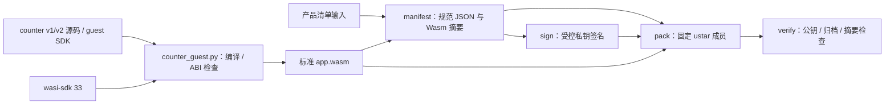

# product.pkg v1 主机工具

本目录的 `product_package.py` 提供 `manifest`、`sign`、`pack`、`verify` 四个命令。只处理精确顺序的 `manifest.json`、`signature.bin`、`app.wasm` 三个普通成员；签名域为 `ESP-CONTAINER-PRODUCT-V1` 加一个零字节，再加 manifest 的精确 UTF-8 字节。RSA-3072/PSS 使用 SHA-256、MGF1-SHA-256 和 32 字节 salt。公钥由调用方提供，包内不携带新信任锚。

## 架构拓扑



准备独立 host 依赖：

```bash
python3 -m venv .venv
.venv/bin/pip install -r requirements.txt
```

以下仅示例本地测试材料；不要把真实签名私钥提交到仓库。[counter 样例](../examples/counter/README.md)提供锁定 wasi-sdk 33 的 `tools/counter_guest.py build/check` 入口，`build --source` 可用同一固定配方编译[第二版业务源码](../examples/counter-v2/README.md)。本打包工具在 `manifest`、`pack` 和 `verify` 时检查设备流式扫描器可从签名清单和 Wasm 字节确定的 `wamr-classic-v1`、guest ABI v2、能力声明、导入、五项导出与页内不可变事件区地址、函数类型、内存上限、代码数量与 section profile；counter 自身更窄的固定编译配方仍由样例检查器负责。平台独立授权和 WAMR 指令加载仍须由设备执行。

```bash
.venv/bin/python tools/product_package.py manifest --spec examples/counter/spec.example.json --wasm dist/app.wasm --output dist/manifest.json
.venv/bin/python tools/product_package.py sign --manifest dist/manifest.json --private-key test-private.pem --key-id test-key --output dist/signature.bin
.venv/bin/python tools/product_package.py pack --manifest dist/manifest.json --signature dist/signature.bin --wasm dist/app.wasm --output dist/product.pkg
.venv/bin/python tools/product_package.py verify --package dist/product.pkg --public-key test-public.pem --key-id test-key
```

`manifest` 使用排序且无多余空白的唯一 JSON 编码，拒绝重复键、未知字段与不受支持的版本。`pack` 对给定的三份输入生成确定性的无压缩 POSIX ustar 字节，固定成员顺序、mtime、uid/gid、mode 与填充；`verify` 还要求两个结束块和补齐至 10 KiB ustar record 的规范长度，额外全零尾块也会拒绝。RSA-PSS 采用随机 salt，重复 `sign` 的签名字节可不同；复用同一份已签名 `signature.bin` 才能逐字节重现包。生产签名输入的密钥来源与审批属于发布侧，本工具不生成或轮换任何既有生产凭据。

Wasm 初筛只接受 `econtainer.monotonic_ms() -> i64`、`econtainer.log(i32, i32) -> i32`、`econtainer.timer_start(i32, i32) -> i64` 和 `econtainer.timer_cancel(i64) -> i32` 四项精确函数导入；实际导入分别要求已签名 manifest 的 `monotonic-time`、`log`、`timer` 能力。manifest 声明只表达包需求，设备最终授权与定时器数量上限仍由平台策略决定；本主机工具没有设备安装或授予权限的入口。

当前 host 编码回归向量使用 `examples/counter/spec.example.json` 的单页清单字段、`tests/wasm_fixture.py` 生成的 171 字节最小有效 Classic ABI 2 模块，以及 `bytes(range(256)) + bytes(range(128))` 作为固定的 384 字节占位签名。生成的规范 manifest 长 546 字节、SHA-256 为 `c64145a7caf097fc29451a8616daa8ad56ff738a9134a5e3d76d4dbe971153d4`；归档长 10,240 字节、SHA-256 为 `8ef5cd8d34db16c5d8919412cbd6c69c0468d696b5a61726f1eb746768e2d71a`。旧的 8 字节空模块不具备设备所需的 ABI section，现已被主机拒绝。占位签名不具备密码学效力，向量仅用于锁住当前主机编码行为；P6-05 的最终包容量与发布签名合同仍待验证。

[公开真实签名向量](../tests/vectors/product-v1/README.md)另以相同清单和 Wasm 保存一份 RSA-3072/PSS 包及主机／设备两种公钥编码。主机与 C 流式验包器均读取该固定包，避免每次随机测试密钥只验证同一轮输入。它使用已销毁的一次性测试私钥，不是设备或发布信任锚。

当前 C3 分支的主机初筛、签名清单和设备回读静态扫描都只接受初始与最大线性内存各一页、清单内存限额 64 KiB 的 guest；私有运行期也固定一页准入，详见[C3 单页切片](../docs/operations/c3-low-memory-profile.md)。当前设备扫描器与 host 初筛仍共同拒绝超过 512 KiB 的 Wasm；`--max-wasm-bytes` 可进一步降低 host 限额，不能提高设备上限。这个 Flash 大小上限不是已冻结的 C3 业务包容量。组件已有[只读流式验包及 Wasm 静态检查切片](../docs/operations/package-stream-checkpoint.md)及候选槽签名包回读准入；设备检查使用验包后得到的签名清单需求，并另外要求平台独立提供能力、内存和栈授权。真实设备分区、完整平台授权和安装链路尚未闭合；本工具的成功结果不能代表设备已可安全安装。


## 浏览器与 Node 验包 SDK

`tools/product-package.mjs` 与配套类型声明从 `esp-container/product-package` 导出 `verifyProductPackage`、`decodePublicKeyPEM` 和 `ProductPackageError`。Node 使用 22+；浏览器使用安全上下文的原生 Web Crypto，无第三方 Node 依赖。仓库根 `package.json` 为私有 npm 装配声明，不发布到 npm registry；消费方使用公开 Git 完整提交 SHA，模块代码归本仓，禁止在私有 Tool 另建包格式或签名实现。

```js
import { verifyProductPackage, decodePublicKeyPEM } from 'esp-container/product-package'

const result = await verifyProductPackage(packageBytes, {
  publicKeySPKI: decodePublicKeyPEM(independentlyConfiguredPublicKeyPEM),
  expectedKeyId: independentlyConfiguredKeyId,
})
```

调用者独立提供受控 SPKI 公钥和预期 key ID，不从包内材料建立信任。SDK 先复制本次包／公钥／标识，再通过现有 v1 规范 ustar 三成员与结束块、清单规范字节、RSA-3072/PSS SHA-256／MGF1-SHA-256／32字节 salt、Wasm 摘要及同一 Classic ABI 2 静态准入；不执行 Wasm。成功返回不可变的完整签名清单、包总 SHA-256／长度和本次 SPKI 指纹，类型、版本、capability 与带单位配额保持原字段语义。

`maxWasmBytes` 和 `maxPackageBytes` 只能在当前公开解析上限内进一步收紧；默认 Wasm 上限 512 KiB，包上限为该值＋4096＋8192字节，实际槽容量由设备装配另外裁决。输入超限、非规范归档／清单、错误公钥／key ID、签名或载荷不符均拒绝。主机验包成功不授予设备产品权限、不证明实际固件支持或已安装；设备仍须按独立平台授权从候选 Flash 重新验签、校验配额、运行试验并报告持久原操作结果。

`npm test` 直接验证公开真实签名向量、错误 RSA 位数／PSS 参数、同一调用的输入变更、重新签名的畸形清单与 Wasm。Python 的 `tests/browser_package_test.py` 向 Node Web Crypto SDK 提交31份独立 tarfile/cryptography生成的输入，逐项对照公开 Python 验包器的接受判断、完整清单和包摘要；无需生产私钥或设备。
